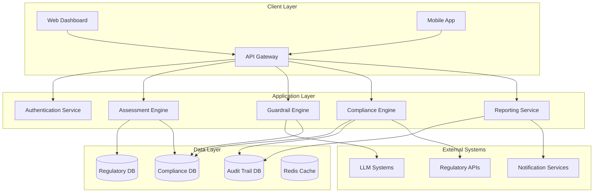
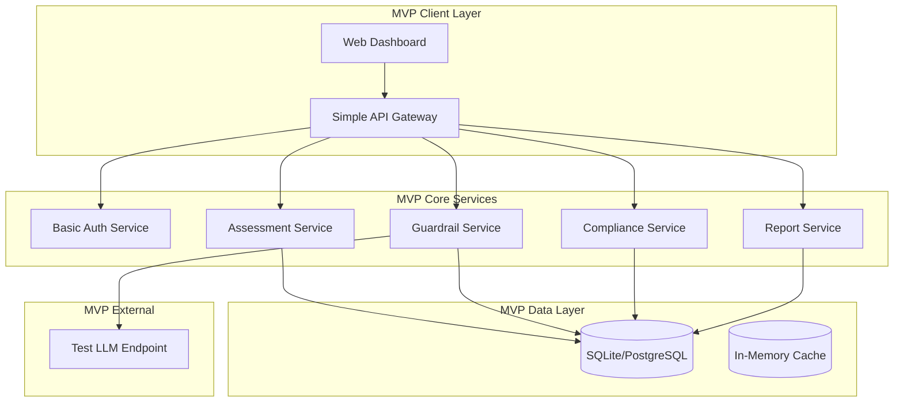

# AI Compliance Platform Design Document

## Overview

The AI Compliance Platform is a comprehensive, dual-purpose system that enables both organizational self-assessment and regulatory agency assessment of AI compliance. The platform operationalizes compliance frameworks through automated guardrails, real-time monitoring, and standardized assessment tools across multiple industries and jurisdictions.

The system architecture supports two primary operational modes:
- **Self-Assessment Mode**: Organizations evaluate their own AI compliance posture using the same standards regulators will apply
- **Regulatory Assessment Mode**: Regulatory agencies conduct standardized, consistent evaluations across different organizations

## Architecture

The platform follows a microservices architecture with clear separation between assessment logic, compliance enforcement, and industry-specific configurations. The system is designed for high availability, scalability, and security to handle sensitive compliance data across multiple jurisdictions.

### High-Level Architecture



## Components and Interfaces

### 1. Assessment Engine
**Purpose**: Core component managing both self-assessment and regulatory assessment workflows

**Key Interfaces**:
- `startAssessment(organizationId, assessmentType, industryProfile)`
- `configureAssessmentCriteria(regulatoryFramework, jurisdiction)`
- `generateAssessmentReport(assessmentId, reportFormat)`
- `compareAssessments(baselineId, currentId)`

**Responsibilities**:
- Orchestrate assessment workflows for both modes
- Apply industry-specific compliance profiles
- Manage assessment state and progress tracking
- Generate standardized assessment reports

### 2. Guardrail Engine
**Purpose**: Real-time AI output filtering and compliance enforcement for LLM systems

**Key Interfaces**:
- `filterLLMOutput(content, context, industryProfile)`
- `configureGuardrails(organizationId, complianceRules)`
- `logViolation(violationType, content, timestamp)`
- `updateGuardrailRules(ruleSet, effectiveDate)`

**Responsibilities**:
- Real-time content filtering for LLM outputs
- Industry-specific guardrail application
- Violation logging and incident management
- Dynamic rule updates and deployment

### 3. Compliance Engine
**Purpose**: Automated compliance monitoring, risk assessment, and continuous evaluation

**Key Interfaces**:
- `performComplianceCheck(systemId, complianceFramework)`
- `calculateRiskScore(organizationId, timeframe)`
- `triggerEscalation(violationLevel, stakeholders)`
- `updateComplianceThresholds(industryProfile, riskTolerance)`

**Responsibilities**:
- Continuous compliance monitoring
- Automated risk assessment and scoring
- Escalation management and notifications
- Compliance threshold management

### 4. Regulatory Data Service
**Purpose**: Centralized management of regulatory requirements across jurisdictions and industries

**Key Interfaces**:
- `getRegulatory Requirements(jurisdiction, industry)`
- `updateRegulatory Framework(frameworkId, changes)`
- `mapRequirementsToControls(requirements, organizationType)`
- `trackRegulatory Changes(subscriptions, notificationPreferences)`

**Responsibilities**:
- Regulatory requirement storage and retrieval
- Cross-jurisdictional requirement mapping
- Regulatory change tracking and notifications
- Industry-specific requirement customization

### 5. Reporting and Analytics Service
**Purpose**: Generate standardized reports for both self-assessment and regulatory review

**Key Interfaces**:
- `generateComplianceReport(organizationId, reportType, timeframe)`
- `createBenchmarkAnalysis(industryProfile, peerGroup)`
- `exportAuditTrail(assessmentId, format)`
- `generateExecutiveSummary(organizationId, stakeholderType)`

**Responsibilities**:
- Standardized report generation
- Cross-industry benchmarking
- Audit trail management and export
- Executive and technical reporting

## Data Models

### Assessment Model
```typescript
interface Assessment {
  id: string;
  organizationId: string;
  assessmentType: 'self' | 'regulatory';
  industryProfile: IndustryProfile;
  jurisdiction: string[];
  status: 'in_progress' | 'completed' | 'under_review';
  criteria: AssessmentCriteria[];
  findings: Finding[];
  complianceScore: number;
  riskLevel: 'low' | 'medium' | 'high' | 'critical';
  createdAt: Date;
  completedAt?: Date;
  assessorId: string;
}
```

### Compliance Framework Model
```typescript
interface ComplianceFramework {
  id: string;
  name: string;
  jurisdiction: string;
  industry: IndustryType;
  version: string;
  requirements: Requirement[];
  controls: Control[];
  assessmentCriteria: AssessmentCriteria[];
  effectiveDate: Date;
  lastUpdated: Date;
}
```

### Guardrail Rule Model
```typescript
interface GuardrailRule {
  id: string;
  name: string;
  industryProfile: IndustryProfile;
  ruleType: 'content_filter' | 'bias_check' | 'privacy_protection' | 'safety_constraint';
  conditions: RuleCondition[];
  actions: RuleAction[];
  severity: 'warning' | 'block' | 'escalate';
  isActive: boolean;
  createdAt: Date;
  lastModified: Date;
}
```

### Organization Profile Model
```typescript
interface OrganizationProfile {
  id: string;
  name: string;
  industryProfile: IndustryProfile;
  jurisdictions: string[];
  aiSystems: AISystem[];
  complianceFrameworks: string[];
  riskTolerance: 'conservative' | 'moderate' | 'aggressive';
  assessmentHistory: Assessment[];
  contactInfo: ContactInfo;
}
```

### Industry Profile Model
```typescript
interface IndustryProfile {
  industry: IndustryType;
  subSector?: string;
  regulatoryFrameworks: string[];
  specificRequirements: Requirement[];
  riskFactors: RiskFactor[];
  guardrailPresets: GuardrailRule[];
  benchmarkMetrics: BenchmarkMetric[];
}
```

## Correctness Properties

*A property is a characteristic or behavior that should hold true across all valid executions of a system-essentially, a formal statement about what the system should do. Properties serve as the bridge between human-readable specifications and machine-verifiable correctness guarantees.*
### Property Reflection

After reviewing all properties identified in the prework, several areas of redundancy and consolidation opportunities were identified:

**Redundancy Analysis:**
- Properties related to "providing documentation/evidence" (1.3, 5.1, 5.2, 9.3) can be consolidated into a comprehensive documentation property
- Properties about "continuous monitoring" (1.5, 2.5, 3.5, 4.5) share similar monitoring patterns and can be combined
- Properties about "automatic configuration/deployment" (3.3, 12.1, 13.2) follow similar deployment patterns
- Properties about "report generation" (1.3, 4.3, 7.1, 10.2, 11.2) share report consistency requirements
- Properties about "cross-system coordination" (4.4, 12.4, 13.4) address similar multi-system scenarios

**Consolidated Properties:**
The following properties have been identified as unique and non-redundant after consolidation:

Property 1: Framework validation consistency
Property 2: Regulatory change impact detection  
Property 3: Guardrail application universality
Property 4: Assessment mode equivalence
Property 5: Industry-specific compliance enforcement
Property 6: Continuous compliance monitoring
Property 7: Documentation completeness and auditability
Property 8: Cross-system compliance coordination
Property 9: Real-time violation response
Property 10: Regulatory synchronization across instances

Based on this analysis, the following correctness properties provide comprehensive coverage without redundancy:

Property 1: Framework validation consistency
*For any* compliance framework created in the system, validation against current regulatory standards should always succeed for compliant frameworks and fail for non-compliant frameworks with specific error details
**Validates: Requirements 1.1**

Property 2: Regulatory change impact detection
*For any* regulatory requirement change, all affected frameworks and systems should be automatically identified and flagged within the system's configured detection timeframe
**Validates: Requirements 1.2, 6.1, 6.2, 9.2**

Property 3: Guardrail application universality
*For any* LLM output generated through the platform, AI guardrails should be applied before delivery, and non-compliant content should be blocked and logged
**Validates: Requirements 3.1, 3.2**

Property 4: Assessment mode equivalence
*For any* organization and assessment criteria, self-assessment mode and regulatory assessment mode should produce equivalent evaluation standards and report formats
**Validates: Requirements 11.1, 11.2**

Property 5: Industry-specific compliance enforcement
*For any* organization with a defined industry profile, the platform should apply sector-specific compliance requirements and guardrails appropriate to that industry
**Validates: Requirements 13.1, 13.2, 13.3, 13.4**

Property 6: Continuous compliance monitoring
*For any* active AI system under platform management, compliance status should be continuously monitored and deviations should trigger appropriate alerts and corrective actions
**Validates: Requirements 1.5, 2.5, 4.1, 4.2, 12.5**

Property 7: Documentation completeness and auditability
*For any* compliance activity or assessment, complete audit trails with timestamps, user attribution, and supporting evidence should be maintained and retrievable
**Validates: Requirements 1.3, 5.1, 5.2, 9.3**

Property 8: Cross-system compliance coordination
*For any* compliance requirement that spans multiple AI systems or jurisdictions, the platform should coordinate enforcement and maintain consistency across all affected systems
**Validates: Requirements 1.4, 4.4, 12.4, 13.2, 13.4**

Property 9: Real-time violation response
*For any* compliance violation detected by the system, immediate corrective measures should be implemented through guardrails and appropriate stakeholders should be notified
**Validates: Requirements 3.2, 4.2, 12.2**

Property 10: Assessment report standardization
*For any* assessment conducted through the platform, generated reports should contain all required elements (evidence, findings, metrics, recommendations) in standardized formats
**Validates: Requirements 4.3, 7.1, 10.2, 10.3, 11.2**

## Error Handling

The AI Compliance Platform implements comprehensive error handling across all system components to ensure reliability and maintain compliance integrity even during system failures.

### Error Categories and Handling Strategies

**1. Compliance Validation Errors**
- **Scenario**: Framework validation failures, requirement conflicts, invalid configurations
- **Handling**: Detailed error messages with specific remediation guidance, rollback to last known good state, escalation to compliance officers
- **Recovery**: Automatic retry with corrected parameters, manual review workflow for complex conflicts

**2. Guardrail System Errors**
- **Scenario**: LLM output filtering failures, guardrail rule deployment errors, real-time processing failures
- **Handling**: Fail-safe to most restrictive guardrails, immediate blocking of potentially non-compliant content, system administrator alerts
- **Recovery**: Graceful degradation to backup filtering systems, manual review queue for blocked content

**3. Assessment Process Errors**
- **Scenario**: Assessment workflow interruptions, data corruption during evaluation, report generation failures
- **Handling**: Assessment state preservation, automatic checkpoint creation, alternative report formats
- **Recovery**: Resume from last checkpoint, data integrity verification, manual assessment completion if needed

**4. Regulatory Data Synchronization Errors**
- **Scenario**: Failed regulatory updates, inconsistent data across instances, network connectivity issues
- **Handling**: Maintain cached regulatory data, flag synchronization failures, continue with last known good data
- **Recovery**: Automatic retry with exponential backoff, manual synchronization triggers, data consistency verification

**5. Cross-System Integration Errors**
- **Scenario**: External system unavailability, API failures, data format mismatches
- **Handling**: Circuit breaker patterns, fallback to cached data, graceful service degradation
- **Recovery**: Health check monitoring, automatic reconnection, data reconciliation processes

## Testing Strategy

The AI Compliance Platform requires a comprehensive testing approach that combines traditional unit testing with property-based testing to ensure correctness across the complex compliance domain.

### Dual Testing Approach

**Unit Testing Focus:**
- Specific compliance scenarios and edge cases
- Integration points between assessment modes
- Industry-specific configuration validation
- Error handling and recovery procedures
- API contract validation
- Database transaction integrity

**Property-Based Testing Focus:**
- Universal compliance properties across all inputs
- Cross-jurisdictional requirement consistency
- Assessment equivalence between modes
- Guardrail effectiveness across content types
- Report standardization across all scenarios
- System behavior under various load conditions

### Property-Based Testing Framework

The platform will use **Hypothesis** (Python) for property-based testing, configured to run a minimum of 100 iterations per property test to ensure comprehensive coverage of the input space.

Each property-based test will be tagged with comments explicitly referencing the correctness property from this design document using the format: **Feature: ai-compliance-platform, Property {number}: {property_text}**

### Testing Configuration

**Test Environment Setup:**
- Isolated test databases for each compliance framework
- Mock regulatory API services for testing regulatory change scenarios
- Simulated LLM systems for guardrail testing
- Multi-jurisdiction test data sets
- Industry-specific test scenarios for all supported sectors

**Performance Testing:**
- Load testing for concurrent assessments across multiple organizations
- Stress testing for high-volume LLM output filtering
- Scalability testing for regulatory data synchronization
- Response time validation for real-time compliance checking

**Security Testing:**
- Penetration testing for assessment data protection
- Access control validation for regulatory vs. self-assessment modes
- Data encryption verification for cross-border compliance data
- Audit trail integrity testing under various attack scenarios

**Compliance Testing:**
- Validation against actual regulatory requirements for each supported industry
- Cross-reference testing between self-assessment and regulatory assessment results
- Benchmark testing against known compliance standards
- Regulatory change simulation testing for system adaptability

The testing strategy ensures that both specific compliance scenarios work correctly (unit tests) and that universal compliance properties hold across all possible inputs and configurations (property-based tests), providing comprehensive validation of the platform's correctness and reliability.

## Prototype MVP Solution

To validate the core concepts and demonstrate value quickly, we'll develop a Minimum Viable Product (MVP) that focuses on the most critical compliance capabilities while maintaining the foundation for full-scale development.

### MVP Scope and Limitations

**MVP Core Features:**
1. **Single Industry Focus**: Financial services compliance (GDPR, PCI DSS, banking regulations)
2. **Basic Dual-Mode Assessment**: Self-assessment and regulatory assessment with simplified workflows
3. **Essential LLM Guardrails**: Content filtering for financial services (PII protection, regulatory language compliance)
4. **Fundamental Compliance Engine**: Basic automated compliance checking and risk scoring
5. **Simple Reporting**: Standardized assessment reports and basic audit trails
6. **Single Jurisdiction**: Focus on US/EU regulatory requirements initially

**MVP Exclusions (Future Phases):**
- Multi-industry profiles (healthcare, automotive, etc.)
- Complex cross-jurisdictional mapping
- Advanced analytics and benchmarking
- Real-time regulatory change tracking
- Mobile applications
- Advanced integration APIs

### MVP Architecture



### MVP Data Models (Simplified)

```typescript
// Simplified Assessment Model for MVP
interface MVPAssessment {
  id: string;
  organizationName: string;
  assessmentType: 'self' | 'regulatory';
  industry: 'financial_services';
  jurisdiction: 'US' | 'EU';
  status: 'in_progress' | 'completed';
  complianceScore: number;
  findings: string[];
  createdAt: Date;
  completedAt?: Date;
}

// Simplified Guardrail Rule for MVP
interface MVPGuardrailRule {
  id: string;
  name: string;
  ruleType: 'pii_protection' | 'regulatory_language';
  pattern: string;
  action: 'block' | 'flag';
  isActive: boolean;
}

// Simplified Organization Profile for MVP
interface MVPOrganization {
  id: string;
  name: string;
  industry: 'financial_services';
  jurisdiction: 'US' | 'EU';
  assessments: MVPAssessment[];
}
```

### MVP Implementation Phases

**Phase 1: Core Infrastructure (Weeks 1-2)**
- Basic web application with authentication
- Simple database schema for organizations and assessments
- Basic API endpoints for CRUD operations
- Simple assessment workflow (self-assessment mode only)

**Phase 2: Assessment Engine (Weeks 3-4)**
- Financial services compliance framework implementation
- Basic assessment questionnaire and scoring
- Simple report generation
- Regulatory assessment mode addition

**Phase 3: Guardrail System (Weeks 5-6)**
- Basic LLM output filtering for PII
- Simple content blocking and logging
- Integration with test LLM endpoint
- Basic violation reporting

**Phase 4: Compliance Automation (Weeks 7-8)**
- Automated compliance checking for basic scenarios
- Simple risk scoring algorithm
- Basic audit trail implementation
- Integration testing and bug fixes

### MVP Success Criteria

**Functional Validation:**
- Organizations can complete both self-assessments and regulatory assessments
- LLM outputs are filtered for basic PII and compliance violations
- Assessment reports are generated in standardized format
- Basic audit trails are maintained for all activities

**Technical Validation:**
- System handles 10+ concurrent assessments
- Guardrails process 1000+ LLM outputs per minute
- Assessment completion time under 30 minutes
- Report generation time under 5 minutes

**User Validation:**
- Compliance officers can navigate assessment workflows intuitively
- Regulatory inspectors can access and review assessment results
- Generated reports contain sufficient detail for compliance validation
- System provides clear guidance for compliance gaps

### MVP to Full Platform Migration Path

**Data Migration Strategy:**
- MVP database schema designed to be compatible with full platform
- Assessment data can be migrated without loss
- Organization profiles can be expanded with additional industry data
- Audit trails maintained during migration

**Feature Expansion Path:**
- Industry profiles can be added incrementally
- Additional jurisdictions can be configured without system changes
- Advanced analytics can be built on existing data foundation
- Integration APIs can be added without disrupting core functionality

**Scalability Considerations:**
- MVP architecture supports horizontal scaling
- Database can be migrated from SQLite to PostgreSQL to distributed systems
- Microservices can be containerized and deployed independently
- Caching layer can be expanded from in-memory to distributed cache

The MVP provides a working demonstration of the core AI compliance platform concepts while establishing a solid foundation for full-scale development. It allows for early user feedback, regulatory validation, and technical proof-of-concept before committing to the complete system implementation.