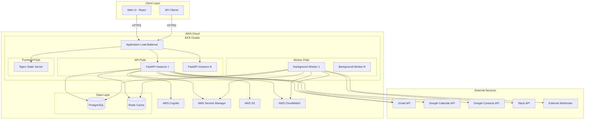

# Design Document: Email Agent Platform

## Overview

The Email Agent Platform transforms an existing LangGraph-based CLI email assistant into a production-ready, multi-user web application deployed on AWS EKS. The system architecture follows a microservices pattern with clear separation between the API layer, AI agent processing, background workers, and frontend presentation.

The platform enables users to manage Gmail accounts through both a conversational AI interface and traditional web UI controls. It integrates with external services (Slack, webhooks, Google Calendar) and implements enterprise-grade security, monitoring, and scalability features.

### Key Design Principles

1. **Isolation**: Each user's Gmail data and OAuth tokens are strictly isolated
2. **Scalability**: Horizontal scaling via Kubernetes HPA for variable load
3. **Security**: Defense in depth with Cognito, IAM roles, encrypted storage, and audit logging
4. **Resilience**: Circuit breakers, retries, and graceful degradation for external dependencies
5. **Observability**: Comprehensive logging, metrics, and tracing for operational visibility

## Architecture

### High-Level Architecture




### Component Architecture

The system consists of the following major components:

1. **API Gateway (FastAPI)**: RESTful API and WebSocket server
2. **LangGraph Agent**: AI-powered email assistant with ReAct architecture
3. **Background Workers**: Celery workers for scheduled tasks and async processing
4. **Web UI (React + Vite)**: Modern single-page application
5. **Authentication Service**: AWS Cognito integration
6. **Gmail Service**: OAuth2 flow and Gmail API wrapper
7. **Integration Services**: Slack, webhooks, calendar, contacts
8. **Data Layer**: PostgreSQL for persistence, Redis for caching

## Components and Interfaces

### 1. API Gateway Component

**Responsibility**: Expose RESTful endpoints and WebSocket connections for client interactions.

**Technology**: FastAPI with Uvicorn ASGI server

**Key Interfaces**:

```python
# Authentication endpoints
POST /api/v1/auth/register
POST /api/v1/auth/login
POST /api/v1/auth/refresh
POST /api/v1/auth/logout

# Gmail OAuth endpoints
GET /api/v1/gmail/oauth/authorize
GET /api/v1/gmail/oauth/callback
DELETE /api/v1/gmail/oauth/disconnect

# Email management endpoints
GET /api/v1/emails?query={query}&limit={limit}&offset={offset}
GET /api/v1/emails/{email_id}
GET /api/v1/emails/{email_id}/thread
POST /api/v1/emails/send
POST /api/v1/emails/draft
PUT /api/v1/emails/draft/{draft_id}
DELETE /api/v1/emails/draft/{draft_id}
POST /api/v1/emails/{email_id}/labels
DELETE /api/v1/emails/{email_id}/labels/{label_id}

# Attachment endpoints
POST /api/v1/attachments/upload
GET /api/v1/attachments/{attachment_id}/download

# AI Agent endpoints
POST /api/v1/agent/chat
GET /api/v1/agent/history

# Scheduled email endpoints
POST /api/v1/emails/schedule
GET /api/v1/emails/scheduled
DELETE /api/v1/emails/scheduled/{scheduled_id}

# Integration endpoints
POST /api/v1/integrations/slack/configure
POST /api/v1/integrations/webhooks
GET /api/v1/integrations/webhooks
DELETE /api/v1/integrations/webhooks/{webhook_id}

# Calendar endpoints
GET /api/v1/calendar/events
POST /api/v1/calendar/events
PUT /api/v1/calendar/events/{event_id}

# Admin endpoints
GET /api/v1/admin/audit-logs
GET /api/v1/admin/users
GET /api/v1/admin/metrics

# WebSocket endpoint
WS /api/v1/ws
```

**Request/Response Formats**:

All API responses follow this structure:
```json
{
  "success": true,
  "data": { ... },
  "error": null,
  "timestamp": "2024-01-15T10:30:00Z"
}
```

Error responses:
```json
{
  "success": false,
  "data": null,
  "error": {
    "code": "INVALID_INPUT",
    "message": "Email address is required",
    "details": { ... }
  },
  "timestamp": "2024-01-15T10:30:00Z"
}
```

**Authentication**: All endpoints except `/auth/register`, `/auth/login`, and OAuth callbacks require JWT token in `Authorization: Bearer <token>` header.

**Rate Limiting**: 100 requests per minute per user, enforced via Redis counters.


### 2. LangGraph Agent Component

**Responsibility**: Process natural language commands and execute email management tasks.

**Technology**: LangGraph with Claude/GPT backend

**Architecture**:

```python
# Agent state definition
class AgentState(TypedDict):
    messages: List[BaseMessage]
    user_id: str
    gmail_service: GmailService
    current_task: Optional[str]
    tool_results: List[Dict]

# Tool definitions
tools = [
    search_emails_tool,
    read_email_tool,
    send_email_tool,
    create_draft_tool,
    apply_label_tool,
    get_thread_tool,
    create_calendar_event_tool,
    search_contacts_tool
]

# ReAct graph structure
graph = StateGraph(AgentState)
graph.add_node("agent", agent_node)
graph.add_node("tools", tool_node)
graph.add_edge(START, "agent")
graph.add_conditional_edges("agent", should_continue, {
    "continue": "tools",
    "end": END
})
graph.add_edge("tools", "agent")
```

**Tool Interface**:

Each tool follows this pattern:
```python
@tool
def search_emails_tool(query: str, max_results: int = 10) -> List[Dict]:
    """Search emails matching the query.
    
    Args:
        query: Gmail search query (e.g., "from:john@example.com")
        max_results: Maximum number of results to return
        
    Returns:
        List of email metadata dictionaries
    """
    pass
```

**Conversation Flow**:
1. User sends natural language message
2. Agent analyzes intent and plans actions
3. Agent calls appropriate tools (Gmail API operations)
4. Agent synthesizes results into natural language response
5. Agent maintains conversation context for follow-up questions

### 3. Gmail Service Component

**Responsibility**: Manage OAuth2 flow and wrap Gmail API operations.

**Key Classes**:

```python
class GmailOAuthService:
    def get_authorization_url(self, user_id: str) -> str:
        """Generate OAuth2 authorization URL"""
        
    def exchange_code_for_tokens(self, code: str, user_id: str) -> OAuthTokens:
        """Exchange authorization code for access/refresh tokens"""
        
    def refresh_access_token(self, user_id: str) -> str:
        """Refresh expired access token"""
        
    def revoke_tokens(self, user_id: str) -> None:
        """Revoke OAuth tokens and disconnect Gmail"""

class GmailAPIService:
    def __init__(self, oauth_service: GmailOAuthService, user_id: str):
        self.oauth_service = oauth_service
        self.user_id = user_id
        
    def search_emails(self, query: str, max_results: int) -> List[Email]:
        """Search emails with Gmail query syntax"""
        
    def get_email(self, email_id: str) -> Email:
        """Retrieve full email by ID"""
        
    def get_thread(self, thread_id: str) -> Thread:
        """Retrieve conversation thread"""
        
    def send_email(self, to: List[str], subject: str, body: str, 
                   attachments: List[str] = None) -> str:
        """Send email and return message ID"""
        
    def create_draft(self, to: List[str], subject: str, body: str) -> str:
        """Create draft and return draft ID"""
        
    def apply_labels(self, email_id: str, label_ids: List[str]) -> None:
        """Apply labels to email"""
        
    def remove_labels(self, email_id: str, label_ids: List[str]) -> None:
        """Remove labels from email"""
```

**OAuth Token Storage**:
- Tokens stored in AWS Secrets Manager with key pattern: `gmail-oauth/{user_id}`
- Token structure:
```json
{
  "access_token": "ya29.a0...",
  "refresh_token": "1//0g...",
  "token_uri": "https://oauth2.googleapis.com/token",
  "client_id": "...",
  "client_secret": "...",
  "scopes": ["https://www.googleapis.com/auth/gmail.modify"],
  "expiry": "2024-01-15T11:30:00Z"
}
```

**Error Handling**:
- Implement exponential backoff for rate limit errors (429)
- Automatic token refresh on 401 errors
- Circuit breaker pattern for Gmail API unavailability


### 4. Authentication Service Component

**Responsibility**: Integrate with AWS Cognito for user authentication and authorization.

**Key Operations**:

```python
class CognitoAuthService:
    def register_user(self, email: str, password: str) -> str:
        """Register new user and return user_id"""
        
    def verify_email(self, user_id: str, code: str) -> bool:
        """Verify email with confirmation code"""
        
    def login(self, email: str, password: str) -> AuthTokens:
        """Authenticate user and return JWT tokens"""
        
    def refresh_token(self, refresh_token: str) -> AuthTokens:
        """Refresh JWT access token"""
        
    def logout(self, access_token: str) -> None:
        """Invalidate user session"""
        
    def reset_password(self, email: str) -> None:
        """Initiate password reset flow"""
        
    def verify_jwt(self, token: str) -> UserClaims:
        """Verify JWT and extract user claims"""
        
    def get_user_role(self, user_id: str) -> str:
        """Get user role (Admin or User)"""
```

**JWT Token Structure**:
```json
{
  "sub": "user-uuid",
  "email": "user@example.com",
  "cognito:groups": ["User"],
  "iat": 1705315800,
  "exp": 1705319400
}
```

**Authorization Middleware**:
```python
async def require_auth(request: Request) -> UserClaims:
    """Extract and verify JWT from Authorization header"""
    token = request.headers.get("Authorization", "").replace("Bearer ", "")
    if not token:
        raise HTTPException(401, "Missing authentication token")
    return cognito_service.verify_jwt(token)

async def require_role(required_role: str):
    """Decorator to enforce role-based access"""
    def decorator(func):
        async def wrapper(request: Request, *args, **kwargs):
            claims = await require_auth(request)
            role = cognito_service.get_user_role(claims["sub"])
            if role != required_role and role != "Admin":
                raise HTTPException(403, "Insufficient permissions")
            return await func(request, *args, **kwargs)
        return wrapper
    return decorator
```

### 5. Background Worker Component

**Responsibility**: Execute scheduled tasks and async processing.

**Technology**: Celery with Redis as message broker

**Task Definitions**:

```python
@celery.task
def send_scheduled_email(scheduled_email_id: str):
    """Send email at scheduled time"""
    email = db.get_scheduled_email(scheduled_email_id)
    gmail_service = GmailAPIService(oauth_service, email.user_id)
    gmail_service.send_email(email.to, email.subject, email.body, email.attachments)
    db.mark_scheduled_email_sent(scheduled_email_id)
    
@celery.task
def deliver_webhook(webhook_id: str, payload: Dict):
    """Deliver webhook with retry logic"""
    webhook = db.get_webhook(webhook_id)
    response = requests.post(webhook.url, json=payload, timeout=10)
    if response.status_code >= 500:
        raise self.retry(countdown=60, max_retries=3)
    db.log_webhook_delivery(webhook_id, response.status_code)
    
@celery.task
def send_slack_notification(user_id: str, email_data: Dict):
    """Send email notification to Slack"""
    slack_config = db.get_slack_config(user_id)
    slack_client.post_message(
        channel=slack_config.channel,
        text=format_email_notification(email_data)
    )
    
@celery.task
def poll_new_emails(user_id: str):
    """Poll Gmail for new emails and trigger webhooks"""
    gmail_service = GmailAPIService(oauth_service, user_id)
    last_check = redis.get(f"last_email_check:{user_id}")
    new_emails = gmail_service.search_emails(f"after:{last_check}")
    
    for email in new_emails:
        # Trigger webhooks
        webhooks = db.get_webhooks(user_id, event_type="email.received")
        for webhook in webhooks:
            deliver_webhook.delay(webhook.id, email.to_dict())
        
        # Send Slack notification
        if db.has_slack_integration(user_id):
            send_slack_notification.delay(user_id, email.to_dict())
    
    redis.set(f"last_email_check:{user_id}", datetime.utcnow().isoformat())

@celery.task
def cleanup_temp_attachments():
    """Delete S3 attachments older than 24 hours"""
    cutoff = datetime.utcnow() - timedelta(hours=24)
    old_attachments = s3.list_objects(prefix="temp/", older_than=cutoff)
    for attachment in old_attachments:
        s3.delete_object(attachment.key)
```

**Scheduling**:
- Celery Beat for periodic tasks
- `poll_new_emails`: Every 5 minutes per active user
- `cleanup_temp_attachments`: Daily at 2 AM UTC
- `send_scheduled_email`: Dynamic scheduling based on user-specified times


### 6. WebSocket Service Component

**Responsibility**: Maintain real-time connections for live updates.

**Implementation**:

```python
class ConnectionManager:
    def __init__(self):
        self.active_connections: Dict[str, List[WebSocket]] = {}
        
    async def connect(self, websocket: WebSocket, user_id: str):
        """Accept WebSocket connection and register user"""
        await websocket.accept()
        if user_id not in self.active_connections:
            self.active_connections[user_id] = []
        self.active_connections[user_id].append(websocket)
        
    async def disconnect(self, websocket: WebSocket, user_id: str):
        """Remove WebSocket connection"""
        self.active_connections[user_id].remove(websocket)
        
    async def send_to_user(self, user_id: str, message: Dict):
        """Send message to all connections for a user"""
        if user_id in self.active_connections:
            for connection in self.active_connections[user_id]:
                await connection.send_json(message)
                
    async def broadcast(self, message: Dict):
        """Send message to all connected users"""
        for connections in self.active_connections.values():
            for connection in connections:
                await connection.send_json(message)

@app.websocket("/api/v1/ws")
async def websocket_endpoint(websocket: WebSocket, token: str):
    """WebSocket endpoint with JWT authentication"""
    try:
        claims = cognito_service.verify_jwt(token)
        user_id = claims["sub"]
        await manager.connect(websocket, user_id)
        
        # Send heartbeat every 30 seconds
        while True:
            await asyncio.sleep(30)
            await websocket.send_json({"type": "heartbeat"})
            
    except WebSocketDisconnect:
        await manager.disconnect(websocket, user_id)
    except Exception as e:
        logger.error(f"WebSocket error: {e}")
        await websocket.close()
```

**Message Types**:

```python
# New email notification
{
    "type": "email.received",
    "data": {
        "email_id": "...",
        "from": "sender@example.com",
        "subject": "...",
        "preview": "...",
        "timestamp": "2024-01-15T10:30:00Z"
    }
}

# Email state change
{
    "type": "email.updated",
    "data": {
        "email_id": "...",
        "labels": ["INBOX", "IMPORTANT"]
    }
}

# Agent task completion
{
    "type": "agent.response",
    "data": {
        "message": "I've sent the email to john@example.com",
        "task_id": "..."
    }
}

# Heartbeat
{
    "type": "heartbeat",
    "timestamp": "2024-01-15T10:30:00Z"
}
```

### 7. Integration Services

#### Slack Integration

```python
class SlackIntegrationService:
    def configure(self, user_id: str, webhook_url: str, channel: str):
        """Configure Slack integration for user"""
        db.save_slack_config(user_id, webhook_url, channel)
        
    def send_notification(self, user_id: str, email: Email):
        """Send email notification to Slack"""
        config = db.get_slack_config(user_id)
        message = {
            "channel": config.channel,
            "blocks": [
                {
                    "type": "header",
                    "text": {"type": "plain_text", "text": "New Email"}
                },
                {
                    "type": "section",
                    "fields": [
                        {"type": "mrkdwn", "text": f"*From:*\n{email.sender}"},
                        {"type": "mrkdwn", "text": f"*Subject:*\n{email.subject}"}
                    ]
                },
                {
                    "type": "section",
                    "text": {"type": "mrkdwn", "text": email.preview}
                },
                {
                    "type": "actions",
                    "elements": [
                        {
                            "type": "button",
                            "text": {"type": "plain_text", "text": "Reply"},
                            "value": email.id,
                            "action_id": "reply_email"
                        }
                    ]
                }
            ]
        }
        requests.post(config.webhook_url, json=message)
        
    def handle_interaction(self, payload: Dict):
        """Handle Slack button interactions"""
        action = payload["actions"][0]
        if action["action_id"] == "reply_email":
            email_id = action["value"]
            # Open modal for reply composition
            return self.open_reply_modal(email_id)
```

#### Webhook Service

```python
class WebhookService:
    def register(self, user_id: str, url: str, event_types: List[str], 
                 secret: str = None) -> str:
        """Register webhook and return webhook_id"""
        webhook_id = generate_uuid()
        db.save_webhook(webhook_id, user_id, url, event_types, secret)
        return webhook_id
        
    def trigger(self, user_id: str, event_type: str, payload: Dict):
        """Trigger webhooks for event"""
        webhooks = db.get_webhooks(user_id, event_type)
        for webhook in webhooks:
            signed_payload = self.sign_payload(payload, webhook.secret)
            deliver_webhook.delay(webhook.id, signed_payload)
            
    def sign_payload(self, payload: Dict, secret: str) -> Dict:
        """Add HMAC signature to payload"""
        if not secret:
            return payload
        signature = hmac.new(
            secret.encode(),
            json.dumps(payload).encode(),
            hashlib.sha256
        ).hexdigest()
        return {
            "payload": payload,
            "signature": signature,
            "timestamp": datetime.utcnow().isoformat()
        }
```


## Data Models

### Database Schema (PostgreSQL)

```sql
-- Users table (managed by Cognito, replicated for queries)
CREATE TABLE users (
    id UUID PRIMARY KEY,
    email VARCHAR(255) UNIQUE NOT NULL,
    role VARCHAR(50) NOT NULL DEFAULT 'User',
    created_at TIMESTAMP NOT NULL DEFAULT NOW(),
    updated_at TIMESTAMP NOT NULL DEFAULT NOW()
);

-- Sessions table
CREATE TABLE sessions (
    id UUID PRIMARY KEY,
    user_id UUID NOT NULL REFERENCES users(id) ON DELETE CASCADE,
    token_hash VARCHAR(255) NOT NULL,
    expires_at TIMESTAMP NOT NULL,
    created_at TIMESTAMP NOT NULL DEFAULT NOW(),
    INDEX idx_user_id (user_id),
    INDEX idx_expires_at (expires_at)
);

-- Gmail OAuth status table
CREATE TABLE gmail_oauth (
    user_id UUID PRIMARY KEY REFERENCES users(id) ON DELETE CASCADE,
    is_connected BOOLEAN NOT NULL DEFAULT FALSE,
    email_address VARCHAR(255),
    connected_at TIMESTAMP,
    last_sync TIMESTAMP,
    updated_at TIMESTAMP NOT NULL DEFAULT NOW()
);

-- Scheduled emails table
CREATE TABLE scheduled_emails (
    id UUID PRIMARY KEY,
    user_id UUID NOT NULL REFERENCES users(id) ON DELETE CASCADE,
    to_addresses TEXT[] NOT NULL,
    subject VARCHAR(500) NOT NULL,
    body TEXT NOT NULL,
    attachments TEXT[],
    scheduled_time TIMESTAMP NOT NULL,
    status VARCHAR(50) NOT NULL DEFAULT 'pending',
    sent_at TIMESTAMP,
    created_at TIMESTAMP NOT NULL DEFAULT NOW(),
    INDEX idx_user_scheduled (user_id, scheduled_time),
    INDEX idx_status_time (status, scheduled_time)
);

-- Webhooks table
CREATE TABLE webhooks (
    id UUID PRIMARY KEY,
    user_id UUID NOT NULL REFERENCES users(id) ON DELETE CASCADE,
    url VARCHAR(2048) NOT NULL,
    event_types TEXT[] NOT NULL,
    secret VARCHAR(255),
    is_active BOOLEAN NOT NULL DEFAULT TRUE,
    created_at TIMESTAMP NOT NULL DEFAULT NOW(),
    INDEX idx_user_active (user_id, is_active)
);

-- Webhook deliveries table
CREATE TABLE webhook_deliveries (
    id UUID PRIMARY KEY,
    webhook_id UUID NOT NULL REFERENCES webhooks(id) ON DELETE CASCADE,
    event_type VARCHAR(100) NOT NULL,
    payload JSONB NOT NULL,
    status_code INTEGER,
    response_body TEXT,
    delivered_at TIMESTAMP NOT NULL DEFAULT NOW(),
    INDEX idx_webhook_delivered (webhook_id, delivered_at)
);

-- Slack integrations table
CREATE TABLE slack_integrations (
    user_id UUID PRIMARY KEY REFERENCES users(id) ON DELETE CASCADE,
    webhook_url VARCHAR(2048) NOT NULL,
    channel VARCHAR(255) NOT NULL,
    notify_on_receive BOOLEAN NOT NULL DEFAULT TRUE,
    created_at TIMESTAMP NOT NULL DEFAULT NOW(),
    updated_at TIMESTAMP NOT NULL DEFAULT NOW()
);

-- API keys table
CREATE TABLE api_keys (
    id UUID PRIMARY KEY,
    user_id UUID NOT NULL REFERENCES users(id) ON DELETE CASCADE,
    key_hash VARCHAR(255) NOT NULL UNIQUE,
    name VARCHAR(255) NOT NULL,
    last_used_at TIMESTAMP,
    created_at TIMESTAMP NOT NULL DEFAULT NOW(),
    INDEX idx_user_id (user_id)
);

-- Audit logs table
CREATE TABLE audit_logs (
    id UUID PRIMARY KEY,
    user_id UUID REFERENCES users(id) ON DELETE SET NULL,
    action VARCHAR(100) NOT NULL,
    resource_type VARCHAR(100),
    resource_id VARCHAR(255),
    details JSONB,
    ip_address INET,
    user_agent TEXT,
    created_at TIMESTAMP NOT NULL DEFAULT NOW(),
    INDEX idx_user_created (user_id, created_at),
    INDEX idx_action_created (action, created_at)
);

-- Agent conversations table
CREATE TABLE agent_conversations (
    id UUID PRIMARY KEY,
    user_id UUID NOT NULL REFERENCES users(id) ON DELETE CASCADE,
    messages JSONB NOT NULL,
    created_at TIMESTAMP NOT NULL DEFAULT NOW(),
    updated_at TIMESTAMP NOT NULL DEFAULT NOW(),
    INDEX idx_user_updated (user_id, updated_at)
);
```

### Redis Cache Schema

```python
# Session tokens (TTL: 1 hour)
session:{user_id} -> {
    "access_token": "...",
    "refresh_token": "...",
    "expires_at": "..."
}

# Rate limiting (TTL: 1 minute)
rate_limit:{user_id}:{minute} -> counter

# Email metadata cache (TTL: 5 minutes)
email:{email_id} -> {
    "id": "...",
    "from": "...",
    "subject": "...",
    "preview": "...",
    "labels": [...]
}

# Contact cache (TTL: 1 hour)
contacts:{user_id} -> [
    {"name": "...", "email": "..."},
    ...
]

# Last email check timestamp
last_email_check:{user_id} -> "2024-01-15T10:30:00Z"

# WebSocket connection tracking
ws_connections:{user_id} -> set of connection_ids
```

### Domain Models

```python
from dataclasses import dataclass
from datetime import datetime
from typing import List, Optional

@dataclass
class User:
    id: str
    email: str
    role: str
    created_at: datetime
    updated_at: datetime

@dataclass
class Email:
    id: str
    thread_id: str
    from_address: str
    to_addresses: List[str]
    cc_addresses: List[str]
    subject: str
    body_text: str
    body_html: str
    labels: List[str]
    attachments: List['Attachment']
    timestamp: datetime
    is_read: bool

@dataclass
class Attachment:
    id: str
    filename: str
    mime_type: str
    size_bytes: int
    s3_key: Optional[str]

@dataclass
class Draft:
    id: str
    user_id: str
    to_addresses: List[str]
    cc_addresses: List[str]
    subject: str
    body: str
    attachments: List[str]
    created_at: datetime
    updated_at: datetime

@dataclass
class ScheduledEmail:
    id: str
    user_id: str
    to_addresses: List[str]
    subject: str
    body: str
    attachments: List[str]
    scheduled_time: datetime
    status: str
    created_at: datetime

@dataclass
class Webhook:
    id: str
    user_id: str
    url: str
    event_types: List[str]
    secret: Optional[str]
    is_active: bool
    created_at: datetime

@dataclass
class AuditLog:
    id: str
    user_id: Optional[str]
    action: str
    resource_type: Optional[str]
    resource_id: Optional[str]
    details: dict
    ip_address: str
    user_agent: str
    created_at: datetime
```


## Correctness Properties

A property is a characteristic or behavior that should hold true across all valid executions of a system—essentially, a formal statement about what the system should do. Properties serve as the bridge between human-readable specifications and machine-verifiable correctness guarantees.

### Gmail API Integration Properties

Property 1: Email search returns only matching results
*For any* Gmail search query and result set, all returned emails should match the query criteria
**Validates: Requirements 2.1**

Property 2: Email retrieval completeness
*For any* valid email ID, retrieving the email should return all required fields (sender, subject, body, metadata, attachments)
**Validates: Requirements 2.2**

Property 3: Draft creation success
*For any* valid draft data (recipients, subject, body), creating a draft should succeed and return a unique draft ID
**Validates: Requirements 2.3**

Property 4: Email sending success
*For any* valid email data with recipients, subject, and body, sending should succeed and return a message ID
**Validates: Requirements 2.4**

Property 5: Label application round-trip
*For any* email and label, applying the label then retrieving the email should show the label in the email's label list
**Validates: Requirements 2.5**

Property 6: Thread chronological ordering
*For any* conversation thread, retrieving the thread should return messages in chronological order by timestamp
**Validates: Requirements 2.6, 4.6**

Property 7: Gmail API error handling
*For any* Gmail API error response, the Platform should log the error details and return a descriptive user-friendly message
**Validates: Requirements 2.8**

### OAuth2 Authentication Properties

Property 8: Authorization code exchange
*For any* valid OAuth2 authorization code, exchanging it should return both access and refresh tokens
**Validates: Requirements 3.3**

Property 9: OAuth token storage round-trip
*For any* OAuth token stored in Secrets Manager, retrieving it should return the same token data with all fields intact
**Validates: Requirements 3.4**

Property 10: Multi-user OAuth isolation
*For any* two different users, their OAuth tokens should be completely isolated such that user A cannot access user B's tokens
**Validates: Requirements 3.6, 8.1**

Property 11: OAuth token revocation
*For any* user disconnecting their Gmail account, revoking the tokens should make them unusable for subsequent API calls
**Validates: Requirements 3.8**

### API Gateway Properties

Property 12: API response structure consistency
*For any* API endpoint response (success or error), it should follow the defined JSON structure with success, data, error, and timestamp fields
**Validates: Requirements 5.10**

Property 13: Rate limiting enforcement
*For any* user exceeding 100 requests per minute, subsequent requests within that minute should be rejected with a 429 status code
**Validates: Requirements 5.11**

Property 14: Input validation errors
*For any* API request with invalid input parameters, the response should include descriptive validation error messages identifying the invalid fields
**Validates: Requirements 5.12**

### Real-Time Updates Properties

Property 15: New email notification delivery
*For any* new email arriving in a user's Gmail account, all active WebSocket connections for that user should receive a notification message
**Validates: Requirements 6.2**

Property 16: Email state change propagation
*For any* email state change (labels, read status), all active WebSocket connections for the owning user should receive an update message
**Validates: Requirements 6.3**

Property 17: Agent task completion notification
*For any* Email Agent task completion, the WebSocket connection that initiated the task should receive the result message
**Validates: Requirements 6.4**

### Authentication and Authorization Properties

Property 18: Valid credentials authentication
*For any* user with valid email and password credentials, authentication should succeed and return a JWT token
**Validates: Requirements 7.2**

Property 19: Password complexity enforcement
*For any* password not meeting complexity requirements (length, character types), registration or password change should fail with validation errors
**Validates: Requirements 7.3**

Property 20: Registration verification email
*For any* new user registration, a verification email should be sent to the provided email address
**Validates: Requirements 7.5**

Property 21: Successful login JWT issuance
*For any* successful login, the response should include a valid JWT token with user claims
**Validates: Requirements 7.6**

Property 22: JWT validation on protected endpoints
*For any* protected API endpoint, requests with invalid or missing JWT tokens should be rejected with 401 status
**Validates: Requirements 7.7**

Property 23: Expired JWT rejection
*For any* JWT token past its expiration time, requests using that token should be rejected and require re-authentication
**Validates: Requirements 7.8**

Property 24: Password reset email delivery
*For any* password reset request, a verification email with reset link should be sent to the user's email address
**Validates: Requirements 7.9**

### Multi-User Isolation Properties

Property 25: Email query isolation
*For any* authenticated user querying emails, the results should only include emails from that user's Gmail account and never from other users' accounts
**Validates: Requirements 8.2, 8.6**

Property 26: Cross-user data access prevention
*For any* user attempting to access another user's emails, drafts, or configuration data, the request should be denied with 403 status
**Validates: Requirements 8.3**

Property 27: User configuration isolation
*For any* two different users, their configuration data (Slack settings, webhooks, scheduled emails) should be completely isolated
**Validates: Requirements 8.4**

Property 28: Session isolation
*For any* two different users, their session data should be completely isolated such that one user's session cannot access another user's data
**Validates: Requirements 8.5**

### Role-Based Access Control Properties

Property 29: Admin system access
*For any* user with Admin role, requests to system configuration endpoints should succeed
**Validates: Requirements 9.2**

Property 30: Admin audit log access
*For any* user with Admin role, requests to view audit logs for all users should succeed
**Validates: Requirements 9.3**

Property 31: User role data restriction
*For any* user with User role (non-Admin), requests to access other users' data or system endpoints should be denied with 403 status
**Validates: Requirements 9.4**

Property 32: Default role assignment
*For any* new user registration, the assigned role should be "User" by default
**Validates: Requirements 9.5**

Property 33: Role permission validation
*For any* protected endpoint with role requirements, requests from users without the required role should be denied with 403 status
**Validates: Requirements 9.6**

### API Key Authentication Properties

Property 34: API key generation
*For any* user requesting API key generation, a unique API key should be created and associated with that user's account
**Validates: Requirements 10.1**

Property 35: API key user association
*For any* API key, it should map to exactly one user account
**Validates: Requirements 10.2**

Property 36: Valid API key authentication
*For any* API request with a valid API key, authentication should succeed and identify the associated user
**Validates: Requirements 10.3**

Property 37: Revoked API key rejection
*For any* API key that has been revoked, subsequent requests using that key should be rejected with 401 status
**Validates: Requirements 10.4**

Property 38: API key authorization parity
*For any* protected resource, access rules should be identical whether authenticated via API key or JWT token
**Validates: Requirements 10.5**

Property 39: API key audit logging
*For any* API request authenticated with an API key, an audit log entry should be created recording the request
**Validates: Requirements 10.6**

### Security Properties

Property 40: OAuth token exposure prevention
*For any* API response, it should not contain OAuth tokens in the response body or headers
**Validates: Requirements 11.4**

### Audit Logging Properties

Property 41: Comprehensive audit logging
*For any* security-relevant event (authentication, email send, OAuth connection, API key operation, admin action), an audit log entry should be created with timestamp, user ID, action, and details
**Validates: Requirements 12.1, 12.2, 12.3, 12.4, 12.5**

Property 42: Admin audit log query access
*For any* user with Admin role, querying audit logs should return matching log entries
**Validates: Requirements 12.7**

### Slack Integration Properties

Property 43: New email Slack notification
*For any* new email arriving for a user with Slack integration configured, a notification should be sent to the configured Slack channel
**Validates: Requirements 13.1**

Property 44: Slack notification format completeness
*For any* Slack notification, it should include sender, subject, and preview text fields
**Validates: Requirements 13.2**

Property 45: Scheduled Slack summary delivery
*For any* configured Slack summary schedule, when the scheduled time arrives, an email summary should be sent to the Slack channel
**Validates: Requirements 13.4**

Property 46: Slack webhook URL validation
*For any* Slack integration configuration with an invalid webhook URL, the configuration should fail with validation errors
**Validates: Requirements 13.5**

Property 47: Slack delivery failure handling
*For any* failed Slack notification delivery, the error should be logged and a retry should be scheduled
**Validates: Requirements 13.7**

### Webhook System Properties

Property 48: Webhook registration success
*For any* valid webhook configuration (URL, event types), registration should succeed and return a webhook ID
**Validates: Requirements 14.1**

Property 49: Email event webhook triggering
*For any* email event (received, sent, labeled) with matching webhooks configured, all matching webhooks should be triggered with appropriate payloads
**Validates: Requirements 14.2, 14.3, 14.4**

Property 50: Webhook payload format
*For any* webhook delivery, the HTTP request should be POST method with JSON body
**Validates: Requirements 14.5**

Property 51: Webhook payload completeness
*For any* webhook payload, it should include event type, timestamp, and relevant email metadata
**Validates: Requirements 14.6**

Property 52: Webhook retry with backoff
*For any* webhook delivery that fails (5xx response), retries should occur with exponential backoff up to 3 attempts
**Validates: Requirements 14.7**

Property 53: Webhook delivery audit logging
*For any* webhook delivery attempt (success or failure), an audit log entry should be created
**Validates: Requirements 14.8**

Property 54: Webhook URL validation
*For any* webhook registration with an invalid URL format, registration should fail with validation errors
**Validates: Requirements 14.9**

Property 55: Webhook signature generation
*For any* webhook with a configured secret, the payload should include a valid HMAC signature
**Validates: Requirements 14.10**

### Calendar Integration Properties

Property 56: Calendar event creation from natural language
*For any* valid natural language command to create a calendar event, the Email Agent should create the event with extracted date, time, and attendees
**Validates: Requirements 15.2**

Property 57: Calendar event query
*For any* request to query calendar events, upcoming events should be returned
**Validates: Requirements 15.3**

Property 58: Calendar event update
*For any* valid command to update a calendar event, the event should be updated with the new information
**Validates: Requirements 15.4**

Property 59: Calendar invitation email delivery
*For any* calendar event with attendees, invitation emails should be sent to all attendees
**Validates: Requirements 15.5**

Property 60: Calendar event information extraction
*For any* calendar event creation with email context, date, time, and attendee information should be correctly extracted
**Validates: Requirements 15.6**

### Contact Management Properties

Property 61: Contact search results
*For any* contact search query (name or email), all matching contacts should be returned
**Validates: Requirements 16.2**

### Attachment Handling Properties

Property 62: Attachment size validation
*For any* file upload, files under 25MB should succeed and files over 25MB should fail with validation errors
**Validates: Requirements 17.1**

Property 63: Attachment storage round-trip
*For any* uploaded attachment, it should be retrievable from S3 with the same content
**Validates: Requirements 17.2**

Property 64: Email attachment download
*For any* attachment on a received email, downloading should succeed and return the file content
**Validates: Requirements 17.3**

Property 65: Temporary attachment cleanup
*For any* attachment in S3 older than 24 hours, it should be deleted by the cleanup job
**Validates: Requirements 17.5**

Property 66: Multiple attachments support
*For any* email with multiple attachments, all attachments should be correctly stored, associated, and retrievable
**Validates: Requirements 17.7**

### Scheduled Email Properties

Property 67: Email scheduling success
*For any* valid future date/time and email data, scheduling should succeed and return a scheduled email ID
**Validates: Requirements 18.1**

Property 68: Scheduled email storage
*For any* scheduled email, it should be stored with the send timestamp and retrievable before send time
**Validates: Requirements 18.2**

Property 69: Scheduled email delivery at send time
*For any* scheduled email when the send time arrives, the email should be sent via Gmail API
**Validates: Requirements 18.3**

Property 70: Scheduled email status update
*For any* scheduled email that is sent, the status should be updated to "sent" and sent_at timestamp recorded
**Validates: Requirements 18.4**

Property 71: Scheduled email cancellation
*For any* scheduled email before its send time, cancellation should succeed and prevent sending
**Validates: Requirements 18.5**

Property 72: Scheduled email notification
*For any* scheduled email that is sent, the user should receive a notification (via WebSocket or email)
**Validates: Requirements 18.6**

Property 73: Timezone conversion correctness
*For any* scheduled email with timezone-specific send time, the conversion to UTC for storage and back to user timezone for display should be correct
**Validates: Requirements 18.7**

### Caching Properties

Property 74: Cache TTL expiration
*For any* cached item (session, email metadata, contacts) with TTL, accessing after TTL expiration should fetch fresh data from the source
**Validates: Requirements 20.1, 20.2, 20.4, 20.5**

Property 75: Rate limit counter accuracy
*For any* user making API requests, the rate limit counter should accurately increment for each request
**Validates: Requirements 20.3**

Property 76: Cache invalidation on data change
*For any* data modification (email update, contact change), the corresponding cache entry should be invalidated
**Validates: Requirements 20.6**

### Monitoring Properties

Property 77: API metrics recording
*For any* API request, response time and outcome (success/error) should be recorded in metrics
**Validates: Requirements 21.4**

Property 78: Gmail API usage tracking
*For any* Gmail API call, usage should be tracked in metrics for quota monitoring
**Validates: Requirements 21.5**

Property 79: WebSocket connection metrics
*For any* WebSocket connection or disconnection, connection count metrics should be updated
**Validates: Requirements 21.8**

### LangGraph Agent Properties

Property 80: Agent tool execution
*For any* agent tool invocation (search, read, send, draft, label), the tool should execute the corresponding Gmail API operation correctly
**Validates: Requirements 24.3**

Property 81: Agent conversation context preservation
*For any* multi-turn conversation, the agent should maintain context from previous messages when processing new messages
**Validates: Requirements 24.4**

Property 82: Natural language command parsing
*For any* valid natural language command, the agent should parse it into the correct Gmail API operations
**Validates: Requirements 24.5**

Property 83: Agent clarification requests
*For any* ambiguous or unclear command, the agent should ask clarifying questions rather than guessing intent
**Validates: Requirements 24.6**

Property 84: Agent response generation
*For any* completed action, the agent should generate a natural language response describing what was done
**Validates: Requirements 24.7**

Property 85: Multi-step task execution
*For any* multi-step task (e.g., "find emails from John and forward to Sarah"), the agent should execute all steps in the correct order
**Validates: Requirements 24.8**

### Error Handling Properties

Property 86: Gmail API retry with backoff
*For any* Gmail API temporary failure (rate limit, timeout), the Platform should retry with exponential backoff
**Validates: Requirements 28.1**

Property 87: User-friendly error messages
*For any* Email Agent error, the error message returned to the user should be user-friendly and not expose technical details
**Validates: Requirements 28.3**

Property 88: Background job retry on failure
*For any* failed background job, the error should be logged and the job should be scheduled for retry
**Validates: Requirements 28.4**

Property 89: Fallback responses for non-critical failures
*For any* non-critical service failure (contacts, calendar), the Platform should provide fallback responses allowing core functionality to continue
**Validates: Requirements 28.6**

Property 90: Unhandled exception logging
*For any* unhandled exception, the full stack trace should be logged and a generic error message returned to the user
**Validates: Requirements 28.7**


## Error Handling

### Error Categories

The Platform implements comprehensive error handling across four categories:

1. **Client Errors (4xx)**: Invalid requests, authentication failures, authorization denials
2. **Server Errors (5xx)**: Internal failures, external service unavailability
3. **External Service Errors**: Gmail API, Cognito, Slack, webhooks
4. **Background Job Errors**: Scheduled tasks, webhook deliveries, email polling

### Error Handling Strategies

#### Gmail API Errors

```python
class GmailAPIErrorHandler:
    def handle_error(self, error: Exception, operation: str) -> Response:
        if isinstance(error, HttpError):
            if error.resp.status == 429:  # Rate limit
                # Exponential backoff: 1s, 2s, 4s, 8s, 16s
                retry_after = min(2 ** attempt, 16)
                logger.warning(f"Gmail API rate limit, retrying after {retry_after}s")
                time.sleep(retry_after)
                return self.retry(operation)
                
            elif error.resp.status == 401:  # Token expired
                logger.info("OAuth token expired, refreshing")
                oauth_service.refresh_access_token(user_id)
                return self.retry(operation)
                
            elif error.resp.status >= 500:  # Server error
                logger.error(f"Gmail API server error: {error}")
                return self.retry_with_circuit_breaker(operation)
                
            else:  # Client error
                logger.error(f"Gmail API client error: {error}")
                return Response(
                    success=False,
                    error={
                        "code": "GMAIL_API_ERROR",
                        "message": "Unable to complete email operation",
                        "details": self.sanitize_error(error)
                    }
                )
```

#### Circuit Breaker Pattern

```python
class CircuitBreaker:
    def __init__(self, failure_threshold: int = 5, timeout: int = 60):
        self.failure_count = 0
        self.failure_threshold = failure_threshold
        self.timeout = timeout
        self.last_failure_time = None
        self.state = "CLOSED"  # CLOSED, OPEN, HALF_OPEN
        
    def call(self, func, *args, **kwargs):
        if self.state == "OPEN":
            if time.time() - self.last_failure_time > self.timeout:
                self.state = "HALF_OPEN"
            else:
                raise CircuitBreakerOpenError("Service unavailable")
                
        try:
            result = func(*args, **kwargs)
            if self.state == "HALF_OPEN":
                self.state = "CLOSED"
                self.failure_count = 0
            return result
            
        except Exception as e:
            self.failure_count += 1
            self.last_failure_time = time.time()
            
            if self.failure_count >= self.failure_threshold:
                self.state = "OPEN"
                logger.error(f"Circuit breaker opened for {func.__name__}")
                
            raise e
```

#### Database Error Handling

```python
class DatabaseErrorHandler:
    def __init__(self, max_retries: int = 3):
        self.max_retries = max_retries
        
    async def execute_with_retry(self, operation):
        for attempt in range(self.max_retries):
            try:
                return await operation()
            except OperationalError as e:
                if attempt < self.max_retries - 1:
                    logger.warning(f"Database error, retry {attempt + 1}/{self.max_retries}")
                    await asyncio.sleep(2 ** attempt)
                    await self.reconnect()
                else:
                    logger.error("Database operation failed after retries")
                    raise DatabaseUnavailableError("Database temporarily unavailable")
```

#### Background Job Error Handling

```python
@celery.task(bind=True, max_retries=3)
def send_scheduled_email(self, scheduled_email_id: str):
    try:
        email = db.get_scheduled_email(scheduled_email_id)
        gmail_service = GmailAPIService(oauth_service, email.user_id)
        gmail_service.send_email(email.to, email.subject, email.body)
        db.mark_scheduled_email_sent(scheduled_email_id)
        
    except GmailAPIError as e:
        logger.error(f"Failed to send scheduled email: {e}")
        db.log_audit_event("scheduled_email_failed", scheduled_email_id, str(e))
        
        # Retry with exponential backoff
        raise self.retry(exc=e, countdown=60 * (2 ** self.request.retries))
        
    except Exception as e:
        logger.exception(f"Unexpected error sending scheduled email: {e}")
        db.mark_scheduled_email_failed(scheduled_email_id, str(e))
        # Don't retry on unexpected errors
```

#### Webhook Delivery Error Handling

```python
@celery.task(bind=True, max_retries=3)
def deliver_webhook(self, webhook_id: str, payload: Dict):
    webhook = db.get_webhook(webhook_id)
    
    try:
        response = requests.post(
            webhook.url,
            json=payload,
            timeout=10,
            headers={"Content-Type": "application/json"}
        )
        
        db.log_webhook_delivery(
            webhook_id,
            status_code=response.status_code,
            response_body=response.text[:1000]
        )
        
        if response.status_code >= 500:
            # Retry on server errors
            raise self.retry(countdown=60 * (2 ** self.request.retries))
            
    except requests.Timeout:
        logger.warning(f"Webhook timeout: {webhook.url}")
        raise self.retry(countdown=60 * (2 ** self.request.retries))
        
    except requests.RequestException as e:
        logger.error(f"Webhook delivery failed: {e}")
        db.log_webhook_delivery(webhook_id, status_code=0, response_body=str(e))
        
        if self.request.retries >= self.max_retries:
            db.mark_webhook_failed(webhook_id)
```

### Error Response Format

All API errors follow this consistent structure:

```json
{
  "success": false,
  "data": null,
  "error": {
    "code": "ERROR_CODE",
    "message": "User-friendly error message",
    "details": {
      "field": "specific_field",
      "reason": "validation_failed"
    }
  },
  "timestamp": "2024-01-15T10:30:00Z"
}
```

### Error Codes

- `AUTHENTICATION_REQUIRED`: Missing or invalid JWT token
- `AUTHENTICATION_FAILED`: Invalid credentials
- `AUTHORIZATION_DENIED`: Insufficient permissions
- `INVALID_INPUT`: Request validation failed
- `RESOURCE_NOT_FOUND`: Requested resource doesn't exist
- `RATE_LIMIT_EXCEEDED`: Too many requests
- `GMAIL_API_ERROR`: Gmail API operation failed
- `OAUTH_ERROR`: OAuth flow error
- `DATABASE_ERROR`: Database operation failed
- `EXTERNAL_SERVICE_ERROR`: External service unavailable
- `INTERNAL_ERROR`: Unexpected server error


## Testing Strategy

### Dual Testing Approach

The Email Agent Platform requires both unit testing and property-based testing for comprehensive coverage:

- **Unit tests**: Verify specific examples, edge cases, error conditions, and integration points
- **Property tests**: Verify universal properties across all inputs through randomization
- Both approaches are complementary and necessary for production readiness

### Property-Based Testing

**Library Selection**: 
- Python: `hypothesis` for property-based testing
- JavaScript/TypeScript: `fast-check` for frontend testing

**Configuration**:
- Minimum 100 iterations per property test (due to randomization)
- Each property test must reference its design document property
- Tag format: `# Feature: email-agent-platform, Property {number}: {property_text}`

**Property Test Examples**:

```python
from hypothesis import given, strategies as st
import pytest

# Property 1: Email search returns only matching results
@given(
    query=st.text(min_size=1, max_size=100),
    emails=st.lists(st.builds(Email))
)
@pytest.mark.property_test
def test_email_search_returns_matching_results(query, emails, gmail_service):
    """
    Feature: email-agent-platform, Property 1: Email search returns only matching results
    """
    # Setup: Populate test Gmail account with emails
    for email in emails:
        gmail_service.create_test_email(email)
    
    # Execute: Search with query
    results = gmail_service.search_emails(query)
    
    # Verify: All results match query
    for result in results:
        assert gmail_service.matches_query(result, query)

# Property 9: OAuth token storage round-trip
@given(
    user_id=st.uuids(),
    access_token=st.text(min_size=20, max_size=200),
    refresh_token=st.text(min_size=20, max_size=200)
)
@pytest.mark.property_test
def test_oauth_token_storage_roundtrip(user_id, access_token, refresh_token, oauth_service):
    """
    Feature: email-agent-platform, Property 9: OAuth token storage round-trip
    """
    # Setup: Create token
    original_token = OAuthToken(
        access_token=access_token,
        refresh_token=refresh_token,
        expiry=datetime.utcnow() + timedelta(hours=1)
    )
    
    # Execute: Store and retrieve
    oauth_service.store_token(user_id, original_token)
    retrieved_token = oauth_service.get_token(user_id)
    
    # Verify: Tokens are equivalent
    assert retrieved_token.access_token == original_token.access_token
    assert retrieved_token.refresh_token == original_token.refresh_token
    assert abs((retrieved_token.expiry - original_token.expiry).total_seconds()) < 1

# Property 13: Rate limiting enforcement
@given(
    user_id=st.uuids(),
    request_count=st.integers(min_value=101, max_value=200)
)
@pytest.mark.property_test
def test_rate_limiting_enforcement(user_id, request_count, api_client):
    """
    Feature: email-agent-platform, Property 13: Rate limiting enforcement
    """
    # Execute: Make requests exceeding limit
    responses = []
    for _ in range(request_count):
        response = api_client.get("/api/v1/emails", user_id=user_id)
        responses.append(response)
    
    # Verify: Requests after 100 are rate limited
    successful = [r for r in responses if r.status_code == 200]
    rate_limited = [r for r in responses if r.status_code == 429]
    
    assert len(successful) <= 100
    assert len(rate_limited) > 0

# Property 25: Email query isolation
@given(
    user1_id=st.uuids(),
    user2_id=st.uuids(),
    user1_emails=st.lists(st.builds(Email), min_size=1),
    user2_emails=st.lists(st.builds(Email), min_size=1)
)
@pytest.mark.property_test
def test_email_query_isolation(user1_id, user2_id, user1_emails, user2_emails, platform):
    """
    Feature: email-agent-platform, Property 25: Email query isolation
    """
    # Assume: Different users
    assume(user1_id != user2_id)
    
    # Setup: Create emails for both users
    for email in user1_emails:
        platform.create_email(user1_id, email)
    for email in user2_emails:
        platform.create_email(user2_id, email)
    
    # Execute: User 1 queries emails
    user1_results = platform.query_emails(user1_id, query="*")
    
    # Verify: Results only contain user 1's emails
    result_ids = {e.id for e in user1_results}
    user1_ids = {e.id for e in user1_emails}
    user2_ids = {e.id for e in user2_emails}
    
    assert result_ids.issubset(user1_ids)
    assert result_ids.isdisjoint(user2_ids)

# Property 69: Scheduled email delivery at send time
@given(
    scheduled_time=st.datetimes(
        min_value=datetime.utcnow(),
        max_value=datetime.utcnow() + timedelta(days=7)
    ),
    email_data=st.builds(EmailData)
)
@pytest.mark.property_test
def test_scheduled_email_delivery(scheduled_time, email_data, scheduler, gmail_service):
    """
    Feature: email-agent-platform, Property 69: Scheduled email delivery at send time
    """
    # Setup: Schedule email
    scheduled_id = scheduler.schedule_email(
        user_id=email_data.user_id,
        to=email_data.to,
        subject=email_data.subject,
        body=email_data.body,
        scheduled_time=scheduled_time
    )
    
    # Execute: Advance time to send time
    with freeze_time(scheduled_time):
        scheduler.process_scheduled_emails()
    
    # Verify: Email was sent
    scheduled_email = scheduler.get_scheduled_email(scheduled_id)
    assert scheduled_email.status == "sent"
    assert scheduled_email.sent_at is not None
    
    # Verify: Email exists in Gmail
    sent_emails = gmail_service.search_emails(f"subject:{email_data.subject}")
    assert len(sent_emails) > 0
```

### Unit Testing

**Focus Areas**:
- Specific examples demonstrating correct behavior
- Edge cases (empty inputs, boundary values, special characters)
- Error conditions and exception handling
- Integration between components
- Authentication and authorization flows
- WebSocket connection management

**Unit Test Examples**:

```python
import pytest
from fastapi.testclient import TestClient

def test_health_check_endpoint_returns_200(client: TestClient):
    """Verify health check endpoint is accessible"""
    response = client.get("/health")
    assert response.status_code == 200
    assert response.json()["status"] == "healthy"

def test_gmail_oauth_authorization_url_generation(oauth_service):
    """Verify OAuth authorization URL contains required parameters"""
    user_id = "test-user-123"
    auth_url = oauth_service.get_authorization_url(user_id)
    
    assert "accounts.google.com/o/oauth2/v2/auth" in auth_url
    assert "client_id=" in auth_url
    assert "redirect_uri=" in auth_url
    assert "scope=" in auth_url
    assert "gmail.modify" in auth_url

def test_expired_token_triggers_refresh(oauth_service, gmail_service):
    """Verify expired tokens are automatically refreshed"""
    user_id = "test-user-123"
    
    # Setup: Create expired token
    expired_token = OAuthToken(
        access_token="expired_token",
        refresh_token="valid_refresh",
        expiry=datetime.utcnow() - timedelta(hours=1)
    )
    oauth_service.store_token(user_id, expired_token)
    
    # Execute: Attempt Gmail operation
    gmail_service.search_emails(user_id, "test query")
    
    # Verify: Token was refreshed
    current_token = oauth_service.get_token(user_id)
    assert current_token.access_token != "expired_token"
    assert current_token.expiry > datetime.utcnow()

def test_rate_limit_backoff_timing(gmail_service, mocker):
    """Verify exponential backoff on rate limit errors"""
    mock_sleep = mocker.patch("time.sleep")
    
    # Setup: Mock Gmail API to return rate limit error
    mocker.patch.object(
        gmail_service,
        "_make_request",
        side_effect=[
            HttpError(resp=Mock(status=429), content=b"Rate limit"),
            HttpError(resp=Mock(status=429), content=b"Rate limit"),
            {"messages": []}  # Success on third attempt
        ]
    )
    
    # Execute: Search emails
    gmail_service.search_emails("test query")
    
    # Verify: Exponential backoff was used
    assert mock_sleep.call_count == 2
    assert mock_sleep.call_args_list[0][0][0] == 1  # First retry: 1s
    assert mock_sleep.call_args_list[1][0][0] == 2  # Second retry: 2s

def test_malware_attachment_blocked(attachment_service, mocker):
    """Verify malicious attachments are blocked from download"""
    # Setup: Mock malware scanner to detect threat
    mocker.patch.object(
        attachment_service.scanner,
        "scan",
        return_value={"malware_detected": True, "threat": "EICAR-Test"}
    )
    
    # Execute: Attempt to download attachment
    with pytest.raises(MalwareDetectedError) as exc_info:
        attachment_service.download_attachment("malicious-file-id")
    
    # Verify: Appropriate error raised
    assert "malware detected" in str(exc_info.value).lower()

def test_websocket_heartbeat_sent_periodically(websocket_manager, mocker):
    """Verify WebSocket heartbeat messages are sent every 30 seconds"""
    mock_send = mocker.patch.object(websocket_manager, "send_to_user")
    
    # Execute: Run WebSocket connection for 90 seconds
    with freeze_time() as frozen_time:
        websocket_manager.start_heartbeat("user-123")
        
        for _ in range(3):
            frozen_time.tick(delta=timedelta(seconds=30))
            websocket_manager.process_heartbeats()
    
    # Verify: 3 heartbeats sent
    assert mock_send.call_count == 3
    for call in mock_send.call_args_list:
        assert call[0][1]["type"] == "heartbeat"

def test_empty_email_search_returns_empty_list(gmail_service):
    """Edge case: Empty search query returns empty results"""
    results = gmail_service.search_emails("")
    assert results == []

def test_no_search_results_returns_empty_suggestions(agent_service):
    """Edge case: No search results triggers suggestion response"""
    response = agent_service.process_command("find emails from nonexistent@example.com")
    assert "no emails found" in response.lower()
    assert "try" in response.lower() or "suggestion" in response.lower()
```

### Integration Testing

**Focus Areas**:
- End-to-end API workflows
- OAuth flow completion
- WebSocket connection lifecycle
- Background job execution
- External service integration (Gmail, Slack, webhooks)

**Integration Test Example**:

```python
@pytest.mark.integration
def test_complete_email_workflow(client, test_user, gmail_mock):
    """Test complete workflow: authenticate, search, read, reply"""
    # 1. Authenticate
    auth_response = client.post("/api/v1/auth/login", json={
        "email": test_user.email,
        "password": "test_password"
    })
    assert auth_response.status_code == 200
    token = auth_response.json()["data"]["access_token"]
    
    headers = {"Authorization": f"Bearer {token}"}
    
    # 2. Connect Gmail
    oauth_response = client.get("/api/v1/gmail/oauth/authorize", headers=headers)
    assert oauth_response.status_code == 200
    
    # Simulate OAuth callback
    callback_response = client.get(
        f"/api/v1/gmail/oauth/callback?code=test_code&state={test_user.id}",
        headers=headers
    )
    assert callback_response.status_code == 200
    
    # 3. Search emails
    search_response = client.get(
        "/api/v1/emails?query=from:john@example.com",
        headers=headers
    )
    assert search_response.status_code == 200
    emails = search_response.json()["data"]
    assert len(emails) > 0
    
    # 4. Read email
    email_id = emails[0]["id"]
    read_response = client.get(f"/api/v1/emails/{email_id}", headers=headers)
    assert read_response.status_code == 200
    email = read_response.json()["data"]
    assert email["subject"] is not None
    
    # 5. Send reply
    reply_response = client.post("/api/v1/emails/send", headers=headers, json={
        "to": [email["from"]],
        "subject": f"Re: {email['subject']}",
        "body": "This is a reply"
    })
    assert reply_response.status_code == 200
```

### Test Coverage Goals

- **Unit test coverage**: Minimum 80% code coverage
- **Property test coverage**: All 90 correctness properties implemented
- **Integration test coverage**: All major user workflows
- **API endpoint coverage**: 100% of endpoints tested

### Continuous Integration

- Run unit tests on every commit
- Run property tests (100 iterations) on every pull request
- Run integration tests on staging deployment
- Run full property test suite (1000 iterations) nightly
- Block merges if tests fail or coverage drops below threshold

