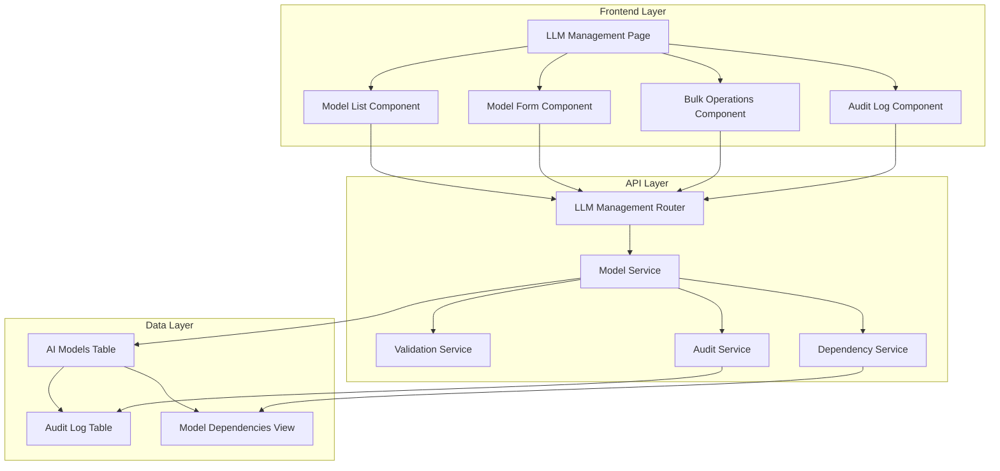

# Design Document: LLM Management

## Overview

The LLM Management feature provides a comprehensive administrative interface for managing AI models within the AI Compliance Platform. The design follows a layered architecture with clear separation between the React frontend components, FastAPI backend services, and SQLite database persistence layer.

The system extends the existing platform architecture by adding new API endpoints, React components, and database operations while maintaining compatibility with existing model selection components. The design emphasizes data validation, audit logging, and secure access control throughout all operations.

## Architecture

The LLM Management system follows the existing platform's three-tier architecture:



The design integrates with existing platform components:
- Authentication middleware for admin access control
- Existing ModelSelectionDropdown component for consistency
- Current API patterns and error handling conventions
- Material-UI design system for consistent user experience

## Components and Interfaces

### Frontend Components

**LLMManagementPage**
- Main container component managing state and routing
- Handles authentication verification and admin access control
- Coordinates between child components and API calls
- Manages global loading states and error boundaries

**ModelListComponent**
- Displays paginated table of AI models with sorting capabilities
- Implements search and filtering functionality
- Provides bulk selection and operation controls
- Handles real-time updates from model operations

**ModelFormComponent**
- Reusable form for both create and edit operations
- Implements comprehensive field validation with real-time feedback
- Supports dynamic industry profile configuration
- Manages form state and submission handling

**BulkOperationsComponent**
- Handles multi-select model operations
- Provides progress tracking for bulk operations
- Implements dependency checking for bulk deletions
- Displays operation results and error summaries

**AuditLogComponent**
- Displays chronological audit trail with filtering
- Supports date range selection and user filtering
- Shows detailed change information for model modifications
- Provides export functionality for compliance reporting

### Backend Services

**LLMManagementRouter**
- RESTful API endpoints following existing platform conventions
- Implements JWT authentication and admin role verification
- Provides comprehensive error handling and response formatting
- Supports bulk operations with transaction management

**ModelService**
- Core business logic for model CRUD operations
- Implements data validation and business rule enforcement
- Manages model caching and cache invalidation
- Coordinates with audit logging for all operations

**ValidationService**
- Schema-based validation for all model data
- Custom validation rules for business constraints
- Dependency validation for deletion operations
- Integration with frontend validation for consistent error messages

**AuditService**
- Comprehensive logging of all model management operations
- Immutable audit record creation and storage
- Audit trail querying and filtering capabilities
- Automated retention and archival management

**DependencyService**
- Analyzes model usage across platform components
- Identifies dependencies before deletion operations
- Maintains dependency mapping for performance
- Provides detailed dependency reports for administrators

### API Endpoints

```
POST   /api/v1/models                    # Create new model
GET    /api/v1/models                    # List models with filtering
GET    /api/v1/models/{id}               # Get specific model
PUT    /api/v1/models/{id}               # Update model
DELETE /api/v1/models/{id}               # Delete model
POST   /api/v1/models/bulk               # Bulk operations
GET    /api/v1/models/{id}/dependencies  # Check dependencies
GET    /api/v1/models/audit              # Audit trail
POST   /api/v1/models/validate           # Validate model data
```

## Data Models

### AI Model Entity

```typescript
interface AIModel {
  id: string;
  name: string;
  provider: string;
  model_type: string;
  capabilities: string[];
  industry_profiles: IndustryProfile[];
  configuration: ModelConfiguration;
  status: 'active' | 'inactive' | 'deprecated';
  created_at: timestamp;
  updated_at: timestamp;
  created_by: string;
  updated_by: string;
}

interface IndustryProfile {
  industry: string;
  compliance_features: string[];
  risk_level: 'low' | 'medium' | 'high';
  certification_status: string;
}

interface ModelConfiguration {
  max_tokens: number;
  temperature_range: [number, number];
  supports_streaming: boolean;
  api_endpoint: string;
  authentication_type: string;
  rate_limits: RateLimit[];
}
```

### Audit Log Entity

```typescript
interface AuditLog {
  id: string;
  operation_type: 'create' | 'update' | 'delete' | 'bulk_delete';
  model_id: string;
  model_name: string;
  user_id: string;
  user_name: string;
  timestamp: timestamp;
  changes: FieldChange[];
  ip_address: string;
  user_agent: string;
}

interface FieldChange {
  field_name: string;
  old_value: any;
  new_value: any;
}
```

### Database Schema Extensions

```sql
-- Extend existing ai_models table
ALTER TABLE ai_models ADD COLUMN status VARCHAR(20) DEFAULT 'active';
ALTER TABLE ai_models ADD COLUMN created_by VARCHAR(255);
ALTER TABLE ai_models ADD COLUMN updated_by VARCHAR(255);

-- New audit log table
CREATE TABLE model_audit_log (
  id VARCHAR(36) PRIMARY KEY,
  operation_type VARCHAR(20) NOT NULL,
  model_id VARCHAR(36),
  model_name VARCHAR(255) NOT NULL,
  user_id VARCHAR(36) NOT NULL,
  user_name VARCHAR(255) NOT NULL,
  timestamp DATETIME DEFAULT CURRENT_TIMESTAMP,
  changes TEXT, -- JSON serialized changes
  ip_address VARCHAR(45),
  user_agent TEXT
);

-- Dependencies tracking view
CREATE VIEW model_dependencies AS
SELECT 
  m.id as model_id,
  m.name as model_name,
  'compliance_check' as dependency_type,
  COUNT(cc.id) as usage_count
FROM ai_models m
LEFT JOIN compliance_checks cc ON cc.model_id = m.id
GROUP BY m.id, m.name;
```

## Correctness Properties

*A property is a characteristic or behavior that should hold true across all valid executions of a system-essentially, a formal statement about what the system should do. Properties serve as the bridge between human-readable specifications and machine-verifiable correctness guarantees.*

### Property 1: Model Display Completeness
*For any* set of AI models in the database, when the LLM Management interface loads, all models should be displayed with their complete key properties (name, provider, model_type, status)
**Validates: Requirements 1.2**

### Property 2: Search and Filter Accuracy
*For any* search term or filter criteria, the displayed model list should contain only models that match all specified criteria, and all matching models should be included
**Validates: Requirements 1.4, 4.2, 4.3**

### Property 3: Model Creation Validation
*For any* model creation attempt, if any required field (name, provider, model_type, capabilities) is missing or invalid, the operation should fail with specific field-level error messages
**Validates: Requirements 2.2, 2.4, 2.6**

### Property 4: Name Uniqueness Enforcement
*For any* model name, whether during creation or update, the system should reject duplicate names while allowing a model to keep its existing name during updates
**Validates: Requirements 2.3, 3.3**

### Property 5: Model Persistence Round Trip
*For any* valid model data, creating the model and then retrieving it should return equivalent model information with a generated ID
**Validates: Requirements 2.5**

### Property 6: Edit Form Population Accuracy
*For any* existing model, when the edit operation is initiated, the form should be populated with all current field values exactly as stored in the database
**Validates: Requirements 3.1**

### Property 7: Update Validation and Persistence
*For any* model update with valid data, the changes should be persisted to the database and reflected in the model list, while invalid updates should be rejected with appropriate error messages
**Validates: Requirements 3.4, 3.5, 3.6**

### Property 8: Dependency-Based Deletion Control
*For any* model deletion attempt, if the model has active dependencies, deletion should be prevented with dependency details displayed; if no dependencies exist, deletion should proceed after confirmation
**Validates: Requirements 5.1, 5.2, 5.4**

### Property 9: Comprehensive Input Validation
*For any* model operation (create, update, delete), all input data should be validated against defined schemas, with validation failures producing field-specific error messages without data loss
**Validates: Requirements 6.1, 6.2**

### Property 10: Error Handling and Recovery
*For any* system error (server error, network failure), the system should display user-friendly error messages, provide retry mechanisms where appropriate, and log errors for administrative review
**Validates: Requirements 6.3, 6.4, 6.5**

### Property 11: Audit Trail Completeness
*For any* model management operation, an immutable audit record should be created containing operation type, timestamp, user information, and complete change details for modifications
**Validates: Requirements 7.1, 7.2, 7.4**

### Property 12: Audit Log Filtering and Display
*For any* audit log query with date, user, or operation type filters, the results should include all matching audit records and exclude all non-matching records
**Validates: Requirements 7.3**

### Property 13: Authorization Enforcement
*For any* user attempting to access LLM Management functionality, admin-level authorization should be verified for both interface access and individual operations, with unauthorized attempts logged and rejected
**Validates: Requirements 8.1, 8.2, 8.4, 8.5**

### Property 14: Session Management
*For any* admin session that expires during operations, the system should prompt for re-authentication while preserving work in progress
**Validates: Requirements 8.3**

### Property 15: Bulk Operation Processing
*For any* bulk operation on multiple selected models, each model should be processed individually with dependency checks performed, and success/failure should be reported for each model with a comprehensive summary
**Validates: Requirements 9.3, 9.4, 9.5**

### Property 16: Multi-Select Functionality
*For any* model selection in the list interface, the multi-select state should be accurately maintained and bulk operation options should be displayed when multiple models are selected
**Validates: Requirements 9.1, 9.2**

### Property 17: System Integration Consistency
*For any* model data change (create, update, delete), all cached model information should be updated across the platform, and the changes should be immediately reflected in existing model selection components
**Validates: Requirements 10.1, 10.2, 10.3, 10.5**

### Property 18: API Compatibility Preservation
*For any* existing API endpoint usage, the functionality should remain unchanged while new LLM Management features are added
**Validates: Requirements 10.4**

## Error Handling

The LLM Management system implements comprehensive error handling across all layers:

### Frontend Error Handling
- **Validation Errors**: Real-time field validation with specific error messages
- **Network Errors**: Retry mechanisms with exponential backoff and offline indicators
- **Authentication Errors**: Automatic redirect to login with session preservation
- **Server Errors**: User-friendly error messages with suggested actions
- **Bulk Operation Errors**: Individual error reporting with operation summaries

### Backend Error Handling
- **Input Validation**: Schema-based validation with detailed error responses
- **Database Errors**: Transaction rollback with appropriate error logging
- **Authentication Errors**: Secure error responses without information leakage
- **Dependency Errors**: Detailed dependency information for deletion failures
- **Audit Errors**: Fallback logging mechanisms to ensure audit trail integrity

### Error Recovery Strategies
- **Optimistic UI Updates**: Immediate UI feedback with rollback on failure
- **Form State Preservation**: Maintain user input during validation failures
- **Graceful Degradation**: Core functionality remains available during partial failures
- **Error Boundaries**: React error boundaries to prevent complete UI crashes
- **Retry Logic**: Automatic retry for transient failures with user control

## Testing Strategy

The LLM Management feature employs a dual testing approach combining unit tests for specific scenarios and property-based tests for comprehensive coverage.

### Unit Testing Approach
Unit tests focus on specific examples, edge cases, and integration points:
- **Component Testing**: Individual React component behavior and rendering
- **API Endpoint Testing**: Specific request/response scenarios and error conditions
- **Service Layer Testing**: Business logic validation and error handling
- **Database Integration**: Specific CRUD operations and constraint validation
- **Authentication Testing**: Access control scenarios and session management

### Property-Based Testing Configuration
Property-based tests verify universal properties across all inputs using **fast-check** for JavaScript/TypeScript:
- **Minimum 100 iterations** per property test to ensure comprehensive input coverage
- **Custom generators** for AI model data, user roles, and operation scenarios
- **Shrinking capabilities** to identify minimal failing examples
- **Deterministic seeding** for reproducible test runs

Each property test references its corresponding design document property:
- **Tag format**: `Feature: llm-management, Property {number}: {property_text}`
- **Traceability**: Direct mapping between correctness properties and test implementations
- **Coverage**: Every correctness property implemented as a single property-based test

### Integration Testing
- **End-to-End Workflows**: Complete user journeys through the LLM Management interface
- **Cross-Component Integration**: Verification of model selection component updates
- **Database Transaction Testing**: Multi-operation scenarios with rollback verification
- **Audit Trail Validation**: Complete audit logging across all operations
- **Performance Testing**: Bulk operation performance with large datasets

### Test Data Management
- **Synthetic Data Generation**: Realistic AI model data for comprehensive testing
- **Test Database Isolation**: Separate test database with automated cleanup
- **Fixture Management**: Reusable test data sets for consistent testing
- **Mock Services**: External API mocking for reliable test execution