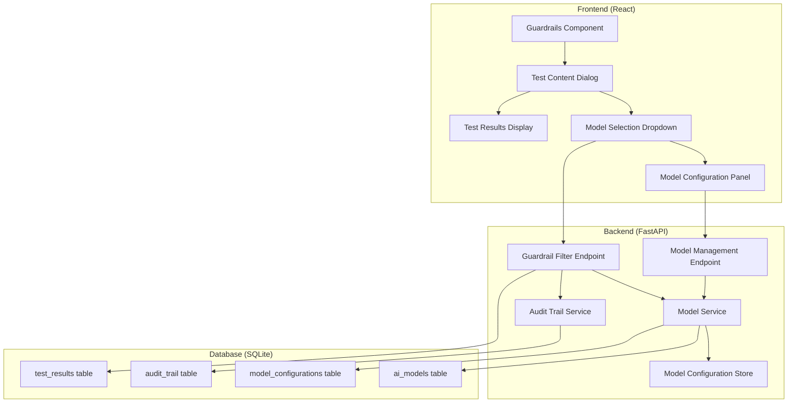

# Design Document: Model Selection Dropdown

## Overview

The model selection dropdown feature extends the existing AI Compliance Platform's guardrail testing functionality by allowing users to select and test against different AI models. This feature integrates seamlessly with the current "Test Content" dialog in the Guardrails component, adding a model selection interface that persists user preferences and tracks compliance results per model.

The design maintains backward compatibility with existing functionality while adding new capabilities for model-specific testing, configuration management, and results tracking. The implementation follows the existing architectural patterns using FastAPI for the backend and React with Material-UI for the frontend.

## Architecture

### System Components



### Integration Points

1. **Guardrails.js Component**: Enhanced "Test Content" dialog with model selection
2. **FastAPI `/guardrails/filter` endpoint**: Extended to accept model parameter
3. **Database Schema**: New tables for model management and configuration
4. **Audit Trail**: Enhanced to track model-specific testing activities

## Components and Interfaces

### Frontend Components

#### Enhanced Test Content Dialog
```typescript
interface TestContentDialogProps {
  open: boolean;
  onClose: () => void;
  onTest: (content: string, modelId: string) => Promise<TestResult>;
}

interface ModelSelectionProps {
  selectedModel: string;
  onModelChange: (modelId: string) => void;
  availableModels: AIModel[];
  industryProfile: string;
}
```

#### Model Selection Dropdown
```typescript
interface AIModel {
  id: string;
  name: string;
  provider: string;
  version: string;
  description: string;
  capabilities: string[];
  supportedIndustries: string[];
  isActive: boolean;
  isRecommended: boolean;
}

interface ModelDropdownProps {
  models: AIModel[];
  selectedModelId: string;
  onSelectionChange: (modelId: string) => void;
  industryProfile: string;
}
```

### Backend Services

#### Model Service
```python
class ModelService:
    def get_available_models(self, industry_profile: str = None) -> List[AIModel]
    def get_model_by_id(self, model_id: str) -> Optional[AIModel]
    def get_model_configuration(self, model_id: str, org_id: int) -> ModelConfiguration
    def update_model_configuration(self, model_id: str, org_id: int, config: ModelConfiguration) -> bool
    def validate_model_availability(self, model_id: str) -> bool
```

#### Enhanced Filter Service
```python
class GuardrailFilterService:
    def filter_content(
        self, 
        content: str, 
        industry_profile: str,
        model_id: str = None,
        model_config: ModelConfiguration = None
    ) -> FilterResult
```

### API Endpoints

#### New Endpoints
```python
# Model Management
GET /models - Get available AI models
GET /models/{model_id} - Get specific model details
GET /models/{model_id}/configuration - Get model configuration
PUT /models/{model_id}/configuration - Update model configuration

# Enhanced existing endpoint
POST /guardrails/filter - Enhanced with optional model_id parameter
```

#### Enhanced Request/Response Models
```python
class LLMFilterRequest(BaseModel):
    content: str
    context: Dict[str, Any] = {}
    industry_profile: str = "financial_services"
    jurisdiction: str = "US"
    model_id: Optional[str] = None  # New field

class LLMFilterResponse(BaseModel):
    filtered_content: str
    is_compliant: bool
    violations: List[str] = []
    applied_rules: List[str] = []
    model_used: Optional[str] = None  # New field
    model_info: Optional[Dict[str, Any]] = None  # New field

class AIModel(BaseModel):
    id: str
    name: str
    provider: str
    version: str
    description: str
    capabilities: List[str]
    supported_industries: List[str]
    is_active: bool = True
    is_recommended: bool = False
    created_at: Optional[datetime] = None

class ModelConfiguration(BaseModel):
    model_id: str
    organization_id: int
    settings: Dict[str, Any] = {}
    is_active: bool = True
    created_at: Optional[datetime] = None
    updated_at: Optional[datetime] = None
```

## Data Models

### Database Schema Extensions

#### AI Models Table
```sql
CREATE TABLE ai_models (
    id TEXT PRIMARY KEY,
    name TEXT NOT NULL,
    provider TEXT NOT NULL,
    version TEXT NOT NULL,
    description TEXT,
    capabilities TEXT, -- JSON array
    supported_industries TEXT, -- JSON array
    is_active BOOLEAN DEFAULT 1,
    is_recommended BOOLEAN DEFAULT 0,
    created_at TIMESTAMP DEFAULT CURRENT_TIMESTAMP,
    updated_at TIMESTAMP DEFAULT CURRENT_TIMESTAMP
);
```

#### Model Configurations Table
```sql
CREATE TABLE model_configurations (
    id INTEGER PRIMARY KEY AUTOINCREMENT,
    model_id TEXT NOT NULL,
    organization_id INTEGER NOT NULL,
    settings TEXT, -- JSON object
    is_active BOOLEAN DEFAULT 1,
    created_at TIMESTAMP DEFAULT CURRENT_TIMESTAMP,
    updated_at TIMESTAMP DEFAULT CURRENT_TIMESTAMP,
    FOREIGN KEY (model_id) REFERENCES ai_models (id),
    FOREIGN KEY (organization_id) REFERENCES organizations (id),
    UNIQUE(model_id, organization_id)
);
```

#### Enhanced Test Results Table
```sql
CREATE TABLE test_results (
    id INTEGER PRIMARY KEY AUTOINCREMENT,
    user_id INTEGER NOT NULL,
    organization_id INTEGER,
    content_hash TEXT NOT NULL,
    model_id TEXT,
    industry_profile TEXT DEFAULT 'financial_services',
    is_compliant BOOLEAN NOT NULL,
    violations_count INTEGER DEFAULT 0,
    applied_rules TEXT, -- JSON array
    test_duration_ms INTEGER,
    created_at TIMESTAMP DEFAULT CURRENT_TIMESTAMP,
    FOREIGN KEY (user_id) REFERENCES users (id),
    FOREIGN KEY (organization_id) REFERENCES organizations (id),
    FOREIGN KEY (model_id) REFERENCES ai_models (id)
);
```

### Session State Management

#### Frontend State
```typescript
interface ModelSelectionState {
  selectedModelId: string | null;
  availableModels: AIModel[];
  modelConfigurations: Record<string, ModelConfiguration>;
  lastUsedModel: string | null;
}

interface TestSessionState {
  currentModel: AIModel | null;
  testHistory: TestResult[];
  sessionStartTime: Date;
}
```

## Correctness Properties

*A property is a characteristic or behavior that should hold true across all valid executions of a system-essentially, a formal statement about what the system should do. Properties serve as the bridge between human-readable specifications and machine-verifiable correctness guarantees.*

Before defining the correctness properties, let me analyze the acceptance criteria to determine which ones are testable as properties.

<function_calls>
<invoke name="prework">
<parameter name="featureName">model-selection-dropdown

### Property Reflection

After analyzing all acceptance criteria, I identified several areas where properties can be consolidated to eliminate redundancy:

- UI display properties can be combined into comprehensive model information display properties
- Session persistence properties can be consolidated into session state management properties  
- Audit trail properties can be combined since they follow the same logging pattern
- Configuration management properties can be consolidated into comprehensive CRUD properties
- Backward compatibility properties can be combined into a single compatibility invariant
- Results tracking properties can be consolidated into comprehensive results management properties

### Correctness Properties

Property 1: **Model Selection State Management**
*For any* user session and model selection action, the system should maintain consistent state where the selected model persists across dialog interactions until session end or explicit reset
**Validates: Requirements 1.2, 1.5, 7.1, 7.2, 7.3, 7.5**

Property 2: **Model Information Display Completeness**
*For any* AI model displayed in the dropdown or interface, the system should show complete information including name, provider, version, capabilities, and industry recommendations
**Validates: Requirements 1.3, 8.1, 8.2, 8.3, 8.4, 8.5**

Property 3: **Default Model Behavior**
*For any* test session where no explicit model selection is made, the system should use a predefined default model and clearly indicate this choice to the user
**Validates: Requirements 1.4, 6.3**

Property 4: **Guardrail Rule Consistency**
*For any* content and guardrail rule combination, the same rules should be applied with identical logic regardless of which AI model is selected for testing
**Validates: Requirements 2.3, 6.4**

Property 5: **Model Context Processing**
*For any* content submission with a selected model, the guardrail engine should process the content using the specified model context and include model information in the results
**Validates: Requirements 2.1, 2.2**

Property 6: **Configuration Application**
*For any* model with existing configuration settings, those settings should be applied during testing, and when no configuration exists, default settings should be used
**Validates: Requirements 2.4, 3.3, 3.4**

Property 7: **Audit Trail Completeness**
*For any* model-related action (testing, configuration changes, availability changes), the system should create audit trail entries that include model information and action details
**Validates: Requirements 2.5, 5.5**

Property 8: **Configuration Access Control**
*For any* user attempting to access model configuration functionality, the system should only allow access to users with organization_admin or regulatory_inspector roles
**Validates: Requirements 3.1, 3.5**

Property 9: **Configuration Validation**
*For any* model configuration update, the system should validate all settings before saving and reject invalid configurations with appropriate error messages
**Validates: Requirements 3.2**

Property 10: **Results Persistence and Tracking**
*For any* completed compliance test, the system should store results with associated model information and provide filtering, display, and export capabilities based on model selection
**Validates: Requirements 4.1, 4.2, 4.3, 4.4, 4.5**

Property 11: **Model Availability Management**
*For any* changes to model availability, the system should update dropdown options immediately, validate selections against availability, and handle graceful fallback when models become unavailable
**Validates: Requirements 5.1, 5.2, 5.3, 5.4**

Property 12: **Backward Compatibility Preservation**
*For any* existing guardrail testing workflow, the system should maintain identical functionality when model selection features are not used, preserving all existing API endpoints and user interface patterns
**Validates: Requirements 6.1, 6.2, 6.5**

Property 13: **Industry Profile Context Preservation**
*For any* user switching between industry profiles, the system should maintain model selection if the selected model supports the new profile, otherwise gracefully reset to a compatible default
**Validates: Requirements 7.4**

## Error Handling

### Model Availability Errors
- **Unavailable Model Selection**: When a user selects a model that becomes unavailable, gracefully fallback to the default model and notify the user
- **Network Connectivity**: Handle API failures when fetching model information with appropriate retry logic and offline fallback
- **Invalid Model Configuration**: Validate all configuration parameters and provide clear error messages for invalid settings

### Session Management Errors
- **Session Timeout**: Clear model selection state when sessions expire and redirect to login
- **Concurrent Sessions**: Handle multiple browser tabs/windows with consistent model selection state
- **Storage Failures**: Gracefully handle localStorage failures for session persistence

### Integration Errors
- **Database Constraints**: Handle foreign key violations when models are deleted while referenced in configurations or test results
- **API Compatibility**: Maintain error response formats for backward compatibility with existing clients
- **Audit Trail Failures**: Ensure core functionality continues even if audit logging fails

## Testing Strategy

### Dual Testing Approach

The testing strategy employs both unit tests and property-based tests to ensure comprehensive coverage:

**Unit Tests** focus on:
- Specific examples of model selection workflows
- Edge cases like empty model lists or invalid configurations  
- Integration points between frontend components and backend APIs
- Error conditions and fallback behaviors

**Property-Based Tests** focus on:
- Universal properties that hold across all model selections and configurations
- Comprehensive input coverage through randomized test data
- Invariant preservation across different user roles and industry profiles
- State consistency across session management operations

### Property-Based Testing Configuration

- **Testing Library**: Use Hypothesis for Python backend tests and fast-check for TypeScript frontend tests
- **Test Iterations**: Minimum 100 iterations per property test to ensure thorough coverage
- **Test Tagging**: Each property test must reference its design document property using the format:
  - **Feature: model-selection-dropdown, Property {number}: {property_text}**

### Test Categories

**Frontend Property Tests**:
- Model dropdown rendering and selection state management
- Session persistence across dialog interactions
- UI consistency and information display completeness
- Industry profile context switching behavior

**Backend Property Tests**:
- Model availability validation and fallback logic
- Configuration CRUD operations and access control
- Audit trail logging for all model-related actions
- Guardrail rule application consistency across models

**Integration Property Tests**:
- End-to-end model selection and testing workflows
- Backward compatibility with existing API endpoints
- Cross-browser session state management
- Database constraint handling and data integrity

**Unit Test Examples**:
- Test model dropdown with empty model list
- Test configuration validation with specific invalid inputs
- Test session cleanup on logout
- Test audit trail entry creation for specific actions
- Test error handling when selected model becomes unavailable

Each property-based test validates universal correctness properties while unit tests catch specific edge cases and integration issues, together providing comprehensive validation of the model selection dropdown feature.